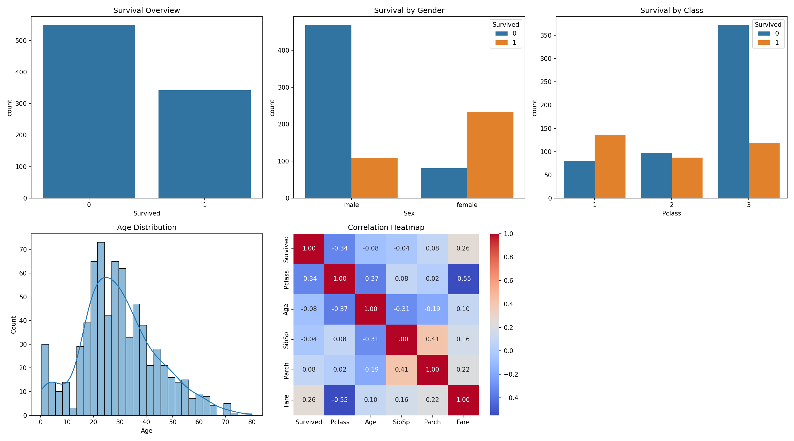

# Titanic EDA — Exploratory Data Analysis

## Deskripsi Project

Analisis eksplorasi data (EDA) pada dataset Titanic untuk memahami
faktor-faktor yang mempengaruhi peluang selamat penumpang.

## Dataset

- Sumber: Kaggle — Titanic Dataset
- 891 baris, 12 kolom
- Target variable: `Survived` (0 = tidak selamat, 1 = selamat)

## Tools

- Python, Pandas, NumPy, Matplotlib, Seaborn

## Key Findings

- Wanita memiliki survival rate jauh lebih tinggi daripada pria
- Penumpang kelas 1 (first class) lebih banyak yang selamat
- Harga tiket (Fare) berkorelasi positif dengan peluang selamat
- 177 missing values pada kolom Age, 687 pada kolom Cabin

## Struktur Repository

```
project-01/
├── data/               # Dataset Titanic
├── notebooks/          # Jupyter notebooks EDA
├── outputs/            # Grafik hasil analisis
├── src/                # Script Python
└── requirements.txt    # Dependencies
```

## Cara Menjalankan

```bash
pip install -r requirements.txt
jupyter notebook notebooks/02-titanic-eda.ipynb
```

## Visualisasi


